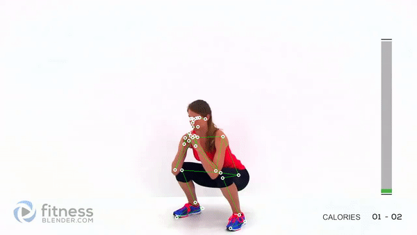

# Research

## Comparing Detectron2 with other libraries
**There are only the configurations which were used in notebooks*

Name | Detectron2 | Mediapipe | Alphapose
---|---|---|---
GitHub | [detectron2](https://github.com/facebookresearch/detectron2) | [mediapipe](https://github.com/google/mediapipe) | [AlphaPose](https://github.com/MVIG-SJTU/AlphaPose)
Description |  Object detection platform | Estimates the full 3D body pose. Optimized for on-device, real-time fitness applications | Multi-person pose estimator
Architecture | Mask R-CNN (Resnet101) | Mobilenet V2 | Resnet
Back | Pytorch | TFlite | Pytorch
Inference time | - | lite: 44fps cpu, 112fps gpu | -
AP @[0.5-0.95] | 78 | - | 73
Keypoints | 17 | 33 | 17

### Detectron2 

* Image

  
* Video

### AlphaPose

* Image

  
* Video

### Google Mediapipe

* Image

  
* Video

[*installation on EC2*](https://dev.classmethod.jp/articles/mediapipe-install-on-aws-ec2-with-gpu-english/)

## Get 3d from 2d video

### Detectron2 + VideoPose3d

### Metrabs

