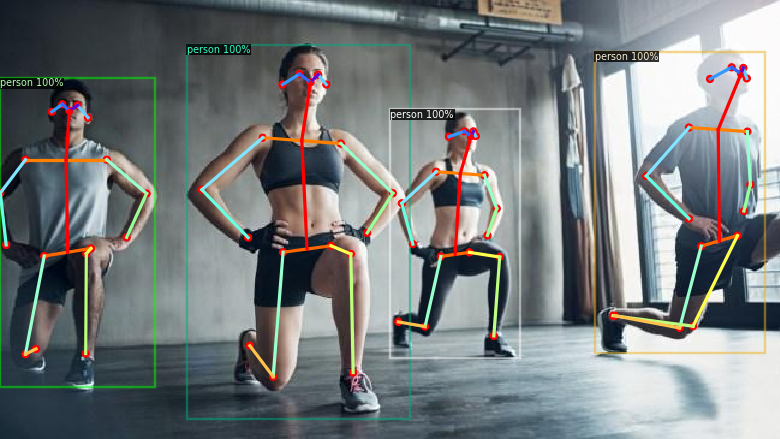
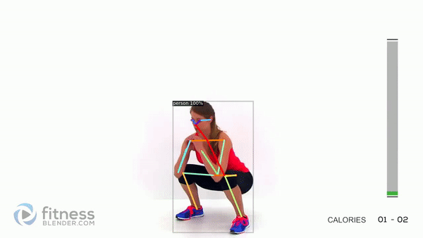
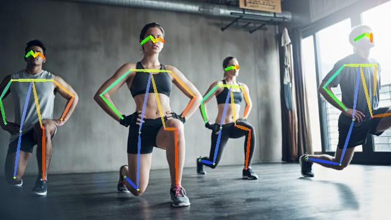
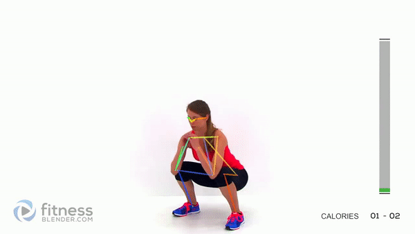
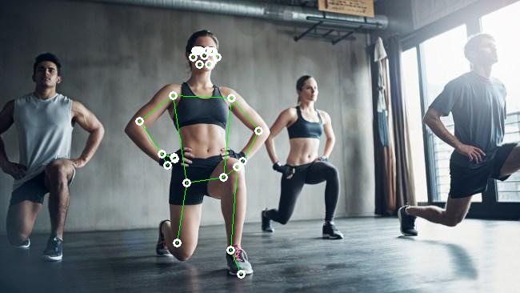
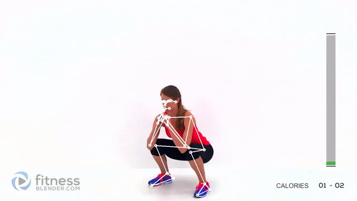
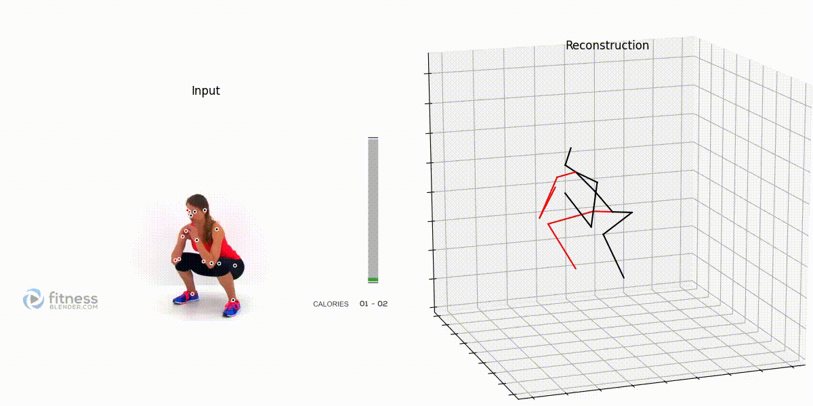
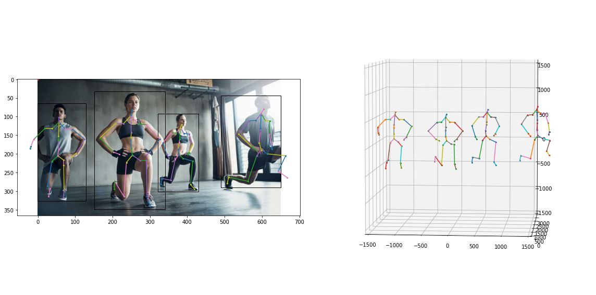

# Research

## Comparing Detectron2 with other libraries

### Detectron2
* Image

  
* Video

### AlphaPose
* Image

  
* Video

### Google Mediapipe
* Image

  
* Video

## Get 3d from 2d video

### Detectron2 + VideoPose3d

### Metrabs
